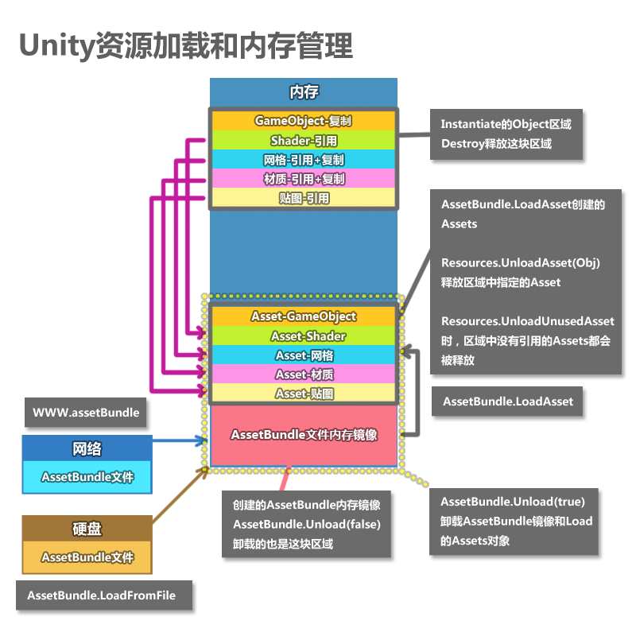

# Unity资源管理之AssetBundle

资源管理做的好坏直接影响到游戏的流畅度，资源的加载影响Cpu时间，资源的卸载影响内存，所以一个好的资源管理方案十分的重要，要掌握好平衡和预算这两点。

- 平衡：要遵循着“申请”和“释放”平衡的原则，只有这样才能达到需要时加载，不需要时释放但目的。
- 预算：在手机游戏开发过程中，CPU和内存的预算十分重要，超过了内存预算会导致游戏crash，超过了单帧Cpu预算会卡顿。

一种是Resource模式   
这种模式是将所有的游戏资源打包成一整块文件，然后通过索引去获取，这种方式体现了Unity的易用性，直接使用Resource.Load()就搞定，但是每次发布包时不管资源有没有修改都会打包，速度非常慢，资源全部堆在一起，替换困难，所以很难去搞资源更新。

另一种是AssetBundle   
这个是Unity弥补Resource方式的不足而增加的，提供了一个对资源更自由的控制，自由的打包。但是早期版本的Unity也是让人头疼，打包时要自己处理好资源的依赖关系，而且要写大量代码去打包，速度还很慢。  

AssetBundle相关的接口比较多，使用起来要根据实际的需求来做，所以到现在貌似也没有很统一的方案，这里介绍下他的使用：

## 一、AB打包

为资源设置AssetBundleName，并调用BuildPipeline.BuildAssetBundles即可。

### 问题1. 资源重复打包问题

虽然Unity 5.x后打包会处理好资源的依赖关系，但是前提是我们设置的AssetBundleName是对的，例如：A，B资源都依赖资源C，但是只设置了A和B的AssetBundleName，那这个时候打包，C资源会分别被打包进A和B的AssetBundle，这样就资源重复打包了，在实际项目中资源很多，靠手工去设置Name不大现实，容易出错，我们可以写一个脚本，构建一个资源依赖树，检测如果资源被引用超出了2次，那么就给这个资源单独设置AssetBundleName。

### 问题2. 包体大小设计

包体大小的设计也很重要，官方推荐是1-2M，因为太大的话，加载时间长，内存占用也多，太小的话，包会非常的多，导致高频率的IO，而且比原本AssetBundle的序列化数据都更小的话，解压解析之类的，反而更消耗。   
如果资源多，每次重新打包很慢，可以进行增量打包，打包时根据对比manifest文件中的Hash进行增量打包。   
还有一点要注意的时，打包时还需要设置下压缩方式，根据需求选择合适的压缩方式，下面介绍AssetBundle的压缩。

### 问题3. 压缩类型

- LZMA格式(默认)：高压缩比，体积最小，增加解压时间
- LZ4格式(BuildAssetBundleOptions.ChunkBasedCompression)：压缩比一般，体积大，解压缩快
- 不压缩(BuildAssetBundleOptions.UncompressedAssetBundle)：体积最大，访问最快

## 二、AB加载

使用AssetBundle动态加载资源首先要获取AssetBundle对象，第二步才是从AssetBundle中加载目标资源。因此本小节将主要关注如何在运行时获取AssetBundle的对象，关于如何从AssetBundle中加载资源将在下一小节中分析。

Unity加载资源主要有两种方式：

- 方式一：先获取WWW对象，再通过WWW.assetBundle获取AssetBundle对象

- 方式二：直接获取AssetBundle对象

### 方式1. 通过WWW对象加载

1. [内存占用高]public WWW(string url)，直接调用WWW类的构造函数，目标AssetBundle所在的路径作为其参数，构造WWW对象的过程中会加载Bundle文件并返回一个WWW对象，完成后会在内存中创建较大的WebStream（解压后的内容，通常为原Bundle文件的4~5倍大小，纹理资源比例可能更大），因此后续的AssetBundle.LoadAsset可以直接在内存中进行。
2. [Unity 2017.1 之后，此方法已不推荐使用]public static WWW LoadFromCacheOrDownload(string url, int version, uint crc = 0)，WWW类的一个静态方法，调用该方法同样会加载Bundle文件同时返回一个WWW对象，和上一个直接调用WWW的构造函数的区别在于该方法会将解压形式的Bundle内容存入磁盘中作为缓存（如果该Bundle已在缓存中，则省去这一步），完成后只会在内存中创建较小的SerializedFile，而后续的AssetBundle.LoadAsset需要通过IO从磁盘中的缓存获取。
   使用www加载资源的话，一般要注意两个问题：
   单个AssetBundle不能太大，最好不要超过1M
   同一个时间最好只下载一个，避免造成内存高峰

### 方式2. 直接获取AssetBundle

1. UnityWebRequest.GetAssetBundle(string uri, uint crc)：
   最推荐的方式来替代www的方式加载AB，以减少webstream内存占用问题，先用UnityWebRequest.GetAssetBundle进行下载，再用DownloadHandlerAssetBundle.GetContent(UnityWebRequest)获取AB对象
2. AssetBundle.LoadFromFile(string path, uint crc = 0, ulong offset = 0)：
   从本地同步加载未压缩或使用LZ4压缩的AB，效率很高。加载LZMA压缩的AB时，会先将其解压，然后再载入内存。
3. AssetBundle.LoadFromMemoryAsync(byte[] binary, uint crc = 0)：
   使用二进制数据异步加载ab对象，通常我们对ab进行加密后，下载到本地解密，然后将解密后的二进制数据传进来，最后获取到ab对象。
   如果是LZMA压缩的AB，会在加载的过程中进行解压；如果是LZ4压缩的AB，会直接加载压缩状态的数据。
   与同步版接口LoadFromMemory立即返回ab对象不同，LoadFromMemoryAsync会在后台线程中执行解压操作。

### 加载要按照依赖关系的顺序

加载资源还需要注意按照依赖关系来加载资源

想想看下面的例子， Bundle1 中的一个材质（Material）引用了 Bundle2 中的一个纹理（Texture），在从 Bundle1 中加载材质前，你需要先将 Bundle2 加载到内存中。**你按照什么顺序加载 Bundle1 和 Bundle2 并不重要，重要的是，想从 Bundle1 中加载材质前，你需要先加载 Bundle2。**

Unity打包AssetBundle时会同时生成一个Manifest的文件，加载方式和普通的AssetBundle一样，只不过他里面存储了依赖关系，哈希值，和变体等。从这个Mainfest文件中可以拿到依赖关系。

## 三、AB卸载

资源卸载的接口只有一个：Assetbundle.Unload(bool)

- Assetbundle.Unload(true):
  卸载AssetBundle的内存镜像，和所有从它这里创建出来的资源，一般项目都是采用这种，可以避免资源内存泄露，比较安全。但是要自己维护好资源的引用计数。
- Assetbundle.Unload(false):
  只会卸载AssetBundle的内存镜像，已经创建出来的资源是不会删除的，要自己手动取卸载资源，相对不安全，容易有资源泄露。

AssetBundle.Unload(True)，并采用一种方法来确保对象不被复制。两种常见的方法是：

1. 在应用程序的生命周期内定义一个合适的节点，并在此期间卸载不需要的AssetBundle，例如在关卡切换或加载屏幕期间。这是最简单和最常见的选择。
2. 维护单个asset对象的引用计数，并仅当所有组成对象都未使用时才卸载AssetBundles。这允许应用程序在不重复内存的情况下卸载和重新加载单个对象。

如果应用程序必须使用AssetBundle.Unload(False)，那么只能通过两种方式卸载各个对象：

1. 在场景和代码中消除对不需要的对象的所有引用。完成后，调用Resources.UnusedAsset。
2. 非附加加载场景。这将销毁当前场景中的所有对象并调用Resources.UnusedAsset。

上面说的是介绍Unity中提供的资源接口和机制，实际项目中，如果进行资源的管理还需要自己设计，一般主要是围绕着**资源引用计数**和**异步加载**这两个点。

## 参考链接

- [AssetBundle SIKI视频课程](http://www.sikiedu.com/my/course/74)
- [AssetBundle详解 知乎](https://zhuanlan.zhihu.com/p/38122862)
- [AssetBundle的原理及最佳实践 UWA](https://blog.uwa4d.com/archives/USparkle_Addressable3.html)

- 查看ab包是否存在冗余的工具：[AssetBundles-Browser](https://github.com/Unity-Technologies/AssetBundles-Browser)

# 代码实现

- [x] 新增按钮进行AB打包，输出
- [x] ABLoadManager单例，支持AB包加载（自动加载依赖）、缓存、卸载
- [ ] 现在想要获取asset（贴图、材质等）需要先加载所属的AB包，然后再去加载对应的 asset，比较繁琐，能否像从Resource文件夹中加载资源一样，底层自动处理加载所属AB包的操作？考虑实现一个接口 XResource.Load 支持这种简化。
- [ ] 卸载现在是直接卸载镜像+对应的asset，需要维护下每个asset对象的引用计数，在所有资源都未被使用时，才去卸载。

