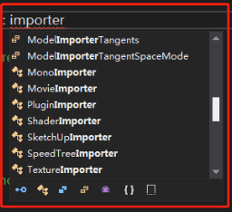
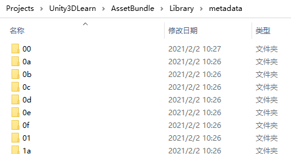

[TOC]

# Unity资源管理之Assets

## 一、什么是Assets

### 1、 Assets目录

创建一个Unity工程时，会默认创建这四个目录，它们的作用分别是：

- **Assets**
  Unity工程实际的资源目录，所有项目用到的资源、代码、配置、库等原始资源只有放置在这个文件夹才会被Unity认可和处理。
- **Library**
  存放Unity处理完毕的资源，大部分的资源导入到Assets目录之后，还需要通过Unity转化成Unity认可的文件，转化后的文件会存储在这个目录。
- **Packages**
  这个是2018以后新增的目录，用于管理Unity分离的packages组件。详细见大佬的文章：https://zhuanlan.zhihu.com/p/77058380
- **ProjectSettings**
  这个目录用于存放Unity的各种项目设定。

所以当你要迁移一个工程，或者将工程复制给别人的时候，只需要将Assets、Packages以及ProjectSettings三个目录备份即可，至于Library会在Unity打开的时候进行检查和自动转化。当然如果你的工程非常庞大，资源非常多，那么迁移的时候连Library一起拷贝传递会节省大量的转化时间。

另外，实际的项目开发期间，我们可能要针对不同的平台进行打包，比如PC包和安卓包。那么复制两份工程，一份设置为PC平台，一份设置为安卓平台，效率会远远大于需要时再切换平台，因为你每次切换到不同的平台，Unity都需要全部重新处理一遍内置资源，非常耗时。

### 2、AssetBundles

**AssetBundles是一个包含了特殊平台、非代码形式Assets的归档文件。**

官方文档链接：https://docs.unity3d.com/Manual/AssetBundlesIntro.html

这里有几个重要信息，首先它是一个归档文件（即捆绑形式的文件类型），其次它拥有平台的差异性，再次它不包含代码，最后它存储的是Unity的Assets。

### 3、Unity资产

我们把一个Asset叫做一个资产，可以理解为Unity能够识别的文件。这里其实又包含两种类型，一种是Unity原生支持的格式，比如：材质球；一种是需要经过Unity处理之后才能支持的，比如：FBX。对于需要处理才能支持的格式，Unity都提供了导入器（Importer）。如下图，代码里输入Importer可以看到有很多个种类的导入器。

要注意，所有的资产原始文件都必须要放在Unity工程的Assets目录，然后经过Unity处理之后存放在Library目录下。

## 二、Assets的识别和使用

### 1、Assets和Objects

Assets这里以及后续的内容都指Unity的资产，可以意指为Unity的Projects窗口里看到的单个文件（或者文件夹）。而Objects这里我们指的是从UnityEngine.Object继承的对象，它其实是一个可以序列化的数据，用来描述一个特定的资源的实例。它可以代表任何Unity引擎所支持的类型，比如：Mesh、Sprite、AudioClip or AnimationClip等等。

大多数的Objects都是Unity内置支持的，但有两种除外：

- **ScriptableObject**
  用来提供给开发者进行自定义数据格式的类型。从该类继承的格式，都可以像Unity的原生类型一样进行序列和反序列化，并且可以从Unity的Inspector窗口进行操作。
- **MonoBehaviour**
  提供了一个指向MonoScript的转换器。MonoScript是一个Unity内部的数据类型，它不是可执行代码，但是会在特定的命名空间和程序集下，保持对某个或者特殊脚本的引用。

Assets和Objects之间是一对多的关系，比如一个Prefab我们可以认为是一个Asset，但是这个Prefab里可以包含很多个Objects，比如：如果是一个UGUI的Prefab，里面就可能会有很多个Text、Button、Image等组件。

### 2、File GUIDs和Local IDs

File GUID，标识这个资产的位置，这个GUID是由Unity根据内部算法自动生成的，并且存放在原始文件的同目录、同名但是后缀为.meta的文件里。

确定了资产文件之后，还需要一个Local IDs来表示当前的Objects在资产里的唯一标识。

File GUID确保了资产在整个Unity工程里唯一，Local ID确保Objects在资产里唯一，这样就可以通过二者的组合去快速找到对应的引用。

Unity还在内部维护了一张资产GUID和路径的映射表，每当有新的资源进入工程，或者删除了某些资源，又或者调整了资源路径，Unity的编辑器都会自动修改这张映射表以便正确地记录资产位置。所以如果.meta文件丢失或者重新生成了不一样的GUID，Unity就会丢失引用，在工程内的表现就是某个脚本显示“Missing”，或者某些贴图材质的丢失导致场景出现粉红色。

### 3、Library中的资源位置

前面我们提到了非Unity支持的格式，需要由导入器进行资源转换。简单来讲，所有的转换结果都会存储在Library/metadata/目录下，以File GUID的前两位进行命名的文件夹里。

**注意：原生支持的Assets资源也会有同样的存储过程，只是不需要再用导入器进行转化而已。**

### 4、Instance ID

File GUID和Local ID确实已经能够在编辑器模式下帮助Unity完成它的规划了，与平台无关、快速定位和维护资源位置以及引用关系。但若投入到运行时，则还有比较大的性能问题。也就是说运行时还是需要一个表现更好的系统。于是Unity又弄了一套缓存（还记得前面那套缓存嘛？是用来记录GUID和文件的路径关系的）。PersistentManager用来把File GUIDs和Local IDs转化为一个简单的、Session唯一的整数，这些整数就是Instance ID。Instance ID很简单，就是一个递增的整数，每当有新对象需要在缓存里注册的时候，简单的递增就行。

简单来说：PersistentManager会维护Instance ID和File GUID、Local ID的映射关系，定位Object源数据的位置以及维护内存中（如果有）Object的实例。只要系统解析到一个Instance ID，就能快速找到代表这个Instance ID的已加载的对象。如果Object没有被加载，File GUID和Local ID也可以快速地定位到指定的Asset资源从而即时进行资源加载。

## 三、资源生命周期

### 1、Object加载

当Unity的应用程序启动的时候，PersistentManager的缓存系统会对项目立刻要用到的数据（比如：启动场景里的这些或者它的依赖项），以及所有包含在Resources目录的Objects进行初始化。如果在运行时导入了Asset或者从AssetBundles（比如：远程下载下来的）加载Object都会产生新的Instance ID。

另外Object在满足下列条件的情况时会自动加载：

- 某个Object的Instance ID被间接引用了
- Object当前没有被加载进内存
- 可以定位到Object的源位置（File GUID 和 Local ID）

另外，如果File GUID和Local ID没有Instance ID，或者有Instance ID，但是对应的Objects已经被卸载了，并且这个Instance ID引用了无效的File GUID和Local ID，那么这个Objects的引用会被保留，但是实际Objects不会被加载。在Unity的编辑器里会显示为：“（Missing）”引用，而在运行时根据Objects类型不一样，有可能会是空指针，有可能会丢失网格或者纹理贴图导致场景或者物体显示粉红色。

### 2、Object卸载

Objects会在一些特定情况下被卸载。

（1）当没有使用的Asset在执行清理的时候，会自动卸载对应的Object。一般是由切场景或者手动调用了Resources.UnloadUnusedAssets的API的时候触发的。但是这个过程只会卸载那些没有任何引用的Objects。

（2）从Resources目录下加载的Objects可以通过调用Resources.UnloadAsset API进行显式的卸载。但这些Objects的Instance ID会保持有效，并且仍然会包含有效的File GUID 和LocalID。当任何Mono的变量或者其它Objects持有了被Resources.UnloadAsset卸载的Objects的引用之后，这个Object在被直接或者间接引用之后会马上被加载。

（3）从AssetBundles里得到的Objects在执行了AssetBundle.Unload(true) API之后，会立刻自动的被卸载，并且这会立刻让这些Objects的File GUID、Local ID以及Instance ID立马失效。任何试图访问它的操作都会触发一个NullReferenceException。但如果调用的是AssetBundle.Unload(false)API，那么生命周期内的Objects不会随着AssetBundle一起被销毁，但是Unity会中断File GUID 、Local ID和对应Object的Instance IDs之间的联系，也就是说，如果这些Objects在未来的某些时候被销毁了，那么当再次对这些Objects进行引用的时候，是没法再自动进行重加载的。

另外，如果Objects中断了它和源AssetBundle的联系之后，那么再次加载相同Asset，Unity也不会复用先前加载的Objects，而是会重新创建Instance ID，也就是说内存里会有多份冗余的资源。

## 参考链接

- 大量参考 [浅谈Assets -- Unity资源映射](https://blog.uwa4d.com/archives/USparkle_Addressable1.html)
- 可以读下了解下 [Unity文件、文件引用、Meta详解](https://blog.uwa4d.com/archives/USparkle_inf_UnityEngine.html)
- [程序丨入门必看：Unity资源加载及管理](https://mp.weixin.qq.com/s/0XFQt8LmqoTxxst_kKDMjw?)
- 拓展 [ScriptableObject的介绍](https://blog.csdn.net/candycat1992/article/details/52181814)